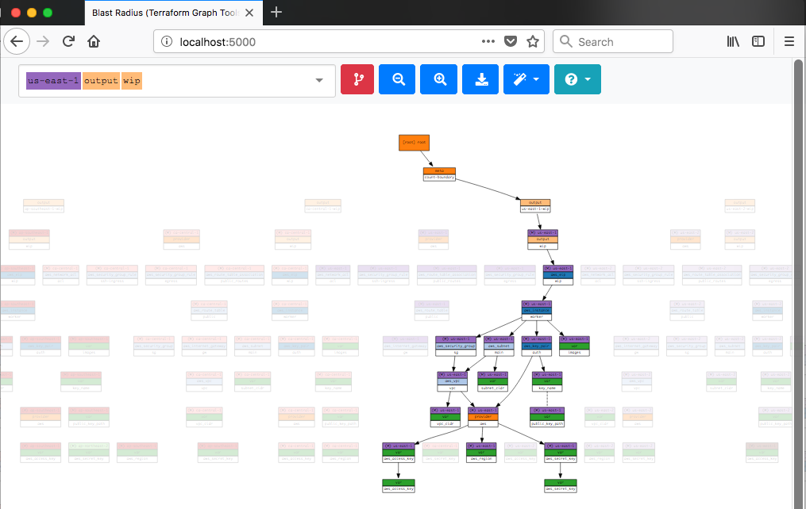

# Blast Radius

[](https://badge.fury.io/py/BlastRadius)

*Blast Radius* is a tool for reasoning about *Terraform* dependency graphs with interactive visualizations. Use *Blast Radius* to:
  * **Learn** about *Terraform* or one of its cloud providers, through [example configurations](https://28mm.github.io/blast-radius-docs/).
  * **Document** your infrastructure
  * **Reason** about relationships between resources, and evaluate changes to them.



  * **Interact** with this diagram (and many others) [here](https://28mm.github.io/blast-radius-docs/).

# Quickstart

Install *Blast Radius* with pip, and *Graphviz* through your system's package manager.

````bash
[...]$ pip3 install BlastRadius
[...]$ brew install graphviz
````

Point *Blast Radius* at an `init-ed` *Terraform* project, and connect with your browser.

```bash
[...]$ blast-radius --serve /path/to/terraform-project
 * Running on http://127.0.0.1:5000/ (Press CTRL+C to quit)
```
## Docker
*Alternatively*, you can launch *Blast Radius* in a docker container. (In this example, the current working directory contains a *Terraform* project.)

```bash
[...]$ docker run -it --rm -p 5000:5000 -v $(pwd):/workdir 28mm/blast-radius
```
*Please note*:
If you organised your terraform directories with stacks and modules, please call *Blast Radius* from the root directory and give the stack's directory as argument (plus the `--serve` argument).

```bash
[...]$ tree -d
/-- project
    |-- modules
    |   |-- foo
    |   |-- bar
    |   `-- dead
    `-- stacks
        `-- beef
             `-- .terraform

[...]$ cd project
docker run -it --rm -p 5000:5000 -v $(pwd):/workdir 28mm/blast-radius --serve stacks/beef
```

*Additional note*: terraform saves module links as _absolute_ paths in _.terraform/modules/<uuid>_ remove them before starting blast-radius (`rm -rf stacks/beef/.terraform/modules`).

# Embeded Figures

You may wish to embed figures produced with *Blast Radius* in other documents. You will need the following:

  1. an `svg` file and `json` document representing the graph and its layout.
  2. `javascript` and `css` found in `.../blastradius/server/static`
  3. a uniquely identified DOM element, where the `<svg>` should appear.

Further details available [here](doc/embedded.md).

# Implementation Details

*Blast Radius* uses the [*Graphviz*](http://graphviz.org/) package to layout graph diagrams, [*PyHCL*](https://github.com/virtuald/pyhcl) to parse [*Terraform*](https://www.terraform.io/) configurations, and [*d3.js*](https://d3js.org/) to implement interactive features and animations.

# Further Reading

  * The motivations for *Blast Radius* are documented in a series of [blog](https://28mm.github.io) posts: [part 1](https://28mm.github.io/notes/d3-terraform-graphs), [part 2](https://28mm.github.io/notes/d3-terraform-graphs-2), and [part 3](https://28mm.github.io/notes/terraform-graphs-3).
  * A catalog of example *Terraform* configurations, and their dependency graphs can be found at [https://28mm.github.io/blast-radius-docs/](https://28mm.github.io/blast-radius-docs/).
